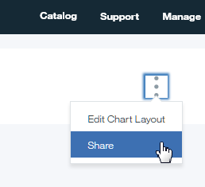

---

copyright:
  years: 2017
lastupdated: "2017-03-14"

---

{:new_window: target="_blank"}
{:shortdesc: .shortdesc}
{:screen: .screen}
{:codeblock: .codeblock}
{:pre: .pre}

# Creación, edición y compartición de informes
{: #uc_insights_creating}

Se pueden crear tantos informes de Delivery Insights como desee para organizar sus métricas. También es posible compartir informes con otras personas dentro de su organización de Bluemix (org).
{:shortdesc}

## Creación de informes

Para crear un informe, abra {{site.data.keyword.DRA_short}}, pulse **Delivery Insights > Informes** y, a continuación, pulse **Añadir informe**. 

Desde el informe, puede añadir tarjetas a la sección **Métricas**, filtrar la actividad en **Actividad de aplicación reciente** y añadir gráficas a la sección **Detalles de informe**. Cada gráfica en la sección **Detalles de informe** es personalizable y admite filtros. Para ver los datos sin formato de la gráfica, en la parte superior derecha del mismo, pulse en el botón Valores de la gráfica y, a continuación, pulse **Datos de informe**.

Para cambiar el orden de los diagramas, en la parte superior derecha de la página, pulse el botón Valores y, a continuación, pulse **Editar diseño de gráfica**. A continuación, arrastre y suelte los gráficos para establecer el orden en el informe.

## Compartición de informes
De forma predeterminada, sólo usted puede ver sus informes de Delivery Insights. Comparta los informes con otros usuarios en su organización de Bluemix. Para compartir un informe con otra persona en su organización de Bluemix, abra el informe, en la parte superior derecha del informe pulse el botón Valores y, a continuación, pulse **Compartir**.  

.

## Creación de informes de auditoría

Los informes de auditoría muestran una lista completa de todas las actividades que satisfacen los filtros que establezca, por ejemplo, como un PDF. Para crear un informe de auditoría, pulse **Delivery Insights > Crear informe de auditoría**. A continuación, especifique la información para el informe, incluido un nombre. Además, establezca el contexto para el informe, por ejemplo, para una aplicación, un entorno lógico o un entorno en un servidor IBM UrbanCode Deploy (un entorno físico). Desde aquí, seleccione los datos que se deben mostrar en el informe y pulse **Crear**. 
