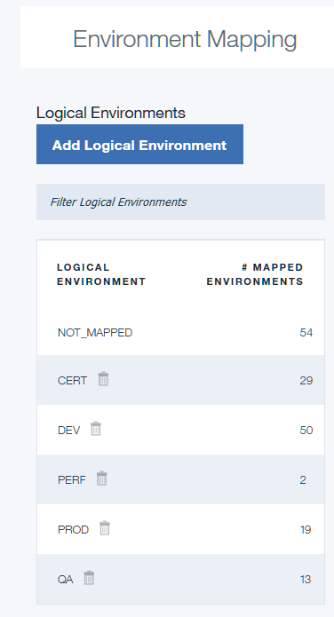

---

copyright:
  years: 2017
lastupdated: "2017-03-14"

---

{:new_window: target="_blank"}
{:shortdesc: .shortdesc}
{:screen: .screen}
{:codeblock: .codeblock}
{:pre: .pre}

# Associazione degli ambienti ai report
{: #uc_insights_mapping}

Le informazioni che visualizzi in Delivery Insights sono raggruppate dagli *ambienti logici*, che sono raccolte di ambienti IBM UrbanCode Deploy (anche conosciuti come *ambienti fisici*). Puoi raggruppare i tuoi ambienti in ambienti logici in qualsiasi modo abbia senso per la tua organizzazione.
{:shortdesc}

## Ambienti logici

Delivery Insights raggruppa i tuoi ambienti IBM UrbanCode Deploy in uno o più ambienti logici. In questo modo puoi raccogliere gli ambienti in gruppi che abbiano senso per te e per la tua organizzazione. Ad esempio, se disponi di molti ambienti di produzione per molte applicazioni, puoi raggruppare tutti questi ambienti in un solo ambiente logico e combinare le metriche per tutti questi ambienti in un solo dashboard dell'ambiente di produzione. L'associazione avviene per stringa di ricerca, così puoi raggruppare gli ambienti in qualsiasi modo abbia senso per i tuoi server IBM UrbanCode Deploy.

## Ambienti logici predefiniti

Per impostazione predefinita, i tuoi report includono gli ambienti logici che corrispondono agli ambienti IBM UrbanCode Deploy utilizzando le stringhe. Ad esempio, tutti gli ambienti con "dev" nel nome sono associati all'ambiente logico DEV e tutti gli ambienti con "prod" all'ambiente logico PROD.

## Associazione degli ambienti agli ambienti logici

Puoi associare manualmente gli ambienti fisici agli ambienti logici o puoi utilizzare i modelli per associarli in modo dinamico.

Per associare gli ambienti fisici agli ambienti logici utilizzando un modello, segui questa procedura:

1. In {{site.data.keyword.DRA_short}}, fai clic su **Delivery Insights > Map Environments**.
1. Fai clic su un ambiente logico esistente o su **Add Logical Environment**.
1. Nelle impostazioni dell'ambiente logico, in **Patterns**, fai clic su **Add Pattern**.
1. Specifica un modello per i nomi dell'ambiente. Puoi utilizzare l'asterisco (*) come carattere jolly. Ad esempio, il modello `env` corrisponde agli ambienti `env1`, `env2` e `env`.
1. Verifica che l'ambiente logico contenga gli ambienti che desideri.

Per associare gli ambienti logici manualmente, fai clic su **Add Manually** e seleziona gli ambienti da aggiungere o rimuovere.

Ora che hai associato gli ambienti agli ambienti logici, puoi visualizzare le informazioni sul report aggregate da questi ambienti logici.
