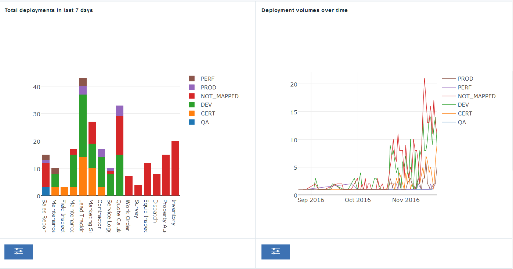

---

copyright:
  years: 2017
lastupdated: "2017-03-31"

---

{:new_window: target="_blank"}
{:shortdesc: .shortdesc}
{:screen: .screen}
{:pre: .pre}

# Integrazione di DevOps Insights con IBM UrbanCode Deploy - panoramica
{: #uc_insights_overview}

Delivery Insights, una parte di {{site.data.keyword.DRA_short}}, mostra le metriche, le statistiche di distribuzione e altre informazioni sulla tua installazione di IBM UrbanCode Deploy. Ad esempio, può mostrare i grafici della durata della distribuzione, degli esiti positivi e negativi, tutti elencati per ambienti raggruppati logicamente.
{:shortdesc}

Se non hai una toolchain o {{site.data.keyword.DRA_short}}, devi prima configurare {{site.data.keyword.DRA_short}}:
1. Dal catalogo {{site.data.keyword.Bluemix}}, fai clic su **{{site.data.keyword.DRA_short}}**, seleziona un piano dei prezzi e fai clic su **Create**.
1. Fai clic sulla scheda **Manage** e in **Start with Delivery Insights for UrbanCode**, fai clic su **Start Here**. In background, Delivery Insights crea una toolchain per la tua organizzazione. Le toolchain aperte sono raccolte di integrazioni dello strumento e in questo caso, IBM UrbanCode Deploy e {{site.data.keyword.DRA_short}} fanno parte della tua toolchain. Per ulteriori informazioni sulle toolchain, vedi [Gestione delle toolchain](../ContinuousDelivery/toolchains_working.html).
1. Nella pagina **Delivery Insights Setup**, segui le istruzioni per configurare DevOps Connect e collegare i tuoi server IBM UrbanCode Deploy.
<!--  1. Set up a system to run DevOps Connect. See [prerequisites](uc_insights_prereqs.html).
  1. Download DevOps Connect, which is provided in a runnable JAR file.
  1. Copy the script from the **Delivery Insights Setup** page and run it. This command starts DevOps Connect with a token that allows it to connect to your organization on {{site.data.keyword.Bluemix}}.
  1. Connect your IBM UrbanCode Deploy servers to DevOps connect. See [Connecting IBM UrbanCode Deploy servers to Delivery Insights](uc_insights_connect_ucd.html). -->

Se già disponi di una toolchain, segui questa procedura per aggiungere Delivery Insights:
1. Se ancora non hai lo strumento {{site.data.keyword.DRA_short}}, aggiungilo alla tua toolchain.
1. Nella tua toolchain, fai clic sullo strumento {{site.data.keyword.DRA_short}}.
1. Nella pagina **Delivery Insights Setup**, segui le istruzioni per configurare DevOps Connect e collegare i tuoi server IBM UrbanCode Deploy.

Dopo aver configurato Delivery Insights e DevOps Connect, puoi visualizzare i dati dai server IBM UrbanCode Deploy in Delivery Insights. Consulta [Connessione dei server IBM UrbanCode Deploy a Delivery Insights](uc_insights_connect_ucd.html).

<!-- 
For questions or issues, see the [questions forum](https://developer.ibm.com/answers/?community=urbancode).
--> 

Alcune delle informazioni che puoi visualizzare in Delivery Insights includono:

- Le statistiche sulla distribuzione, che includono la durata e il volume della distribuzione nel tempo.
- Le statistiche sulla frequenza di errore della distribuzione per applicazione e ambiente.
- Le statistiche sulla distribuzione del componente, incluse la frequenza di errore, l'ora di distribuzione e la durata.

## Panoramica dei sistemi

La topologia per Delivery Insights include una o più installazioni in loco di IBM UrbanCode Deploy <!-- (and optionally IBM UrbanCode Release) --> e il programma di utilità DevOps Connect.

Il seguente diagramma mostra un'installazione tipica di questi sistemi.

- Un'installazione di **IBM UrbanCode Deploy** fornisce le informazioni sulle distribuzioni con esito positivo e negativo per le metriche. IBM UrbanCode Deploy richiede una patch per comunicare con IBM Bluemix DevOps Connect.

<!--
- **IBM UrbanCode Release** is an optional part of the topology. You can use the environment mappings in IBM UrbanCode Release to set logical environments for reports.

-->

- **IBM Bluemix DevOps Connect**, in precedenza noto come programma di utilità IBM UrbanCode Sync, coordina la comunicazione tra le installazioni in loco di IBM UrbanCode Deploy <!-- and IBM UrbanCode Release --> e i servizi ospitati da IBM come UrbanCode Insights. DevOps Connect utilizza la comunicazione HTTPS sicura ai server in loco e l'autenticazione token per fornire i dati a UrbanCode Insights.

  DevOps Connect richiede dei plugin per il collegamento ad altri sistemi nella topologia.

- **Delivery Insights**, parte di {{site.data.keyword.DRA_short}}, fornisce le metriche sull'attività di distribuzione su IBM UrbanCode Deploy, inclusi i tempi di distribuzione e le frequenze di errore in base ai gruppi di ambienti. L'autorizzazione viene controllata dagli account {{site.data.keyword.Bluemix}}.
