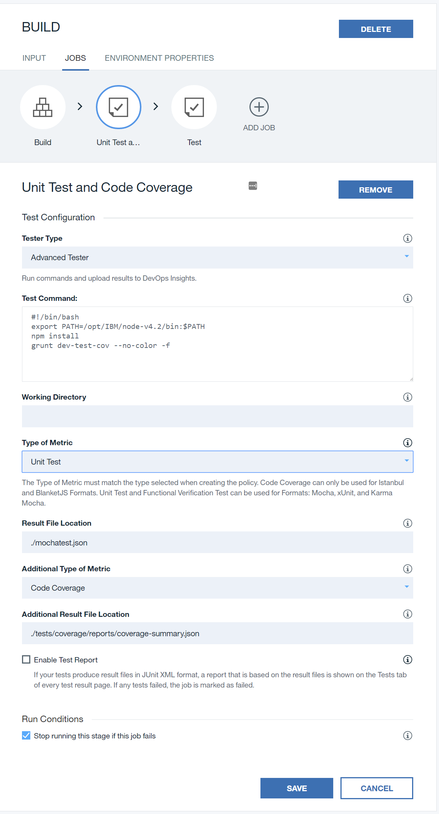

---

copyright:
  years: 2016, 2017
lastupdated: "2017-04-07"

---

{:new_window: target="_blank"}
{:shortdesc: .shortdesc}
{:screen: .screen}
{:codeblock: .codeblock}
{:pre: .pre}

# Integrando ao pipeline de entrega contínua

Depois de incluir o {{site.data.keyword.DRA_short}} em uma cadeia de ferramentas e definir as políticas que ele monitora, integre-o a um {{site.data.keyword.deliverypipeline}}. Para obter mais informações sobre pipelines, veja [a documentação oficial](/docs/services/ContinuousDelivery/pipeline_working.html).

## Preparando estágios de pipeline
{: #integrate_pipeline}

Para que o Deployment Risk analise seu projeto, deve-se definir estágios de preparação e de produção em seu pipeline. Você define os estágios usando propriedades do ambiente de texto, que podem ser localizadas no menu de configuração de cada estágio  em **Propriedades do ambiente**.

1. No estágio de preparação, configure a propriedade `LOGICAL_ENV_NAME` como `STAGING`. 

2. No estágio de produção, configure a propriedade `LOGICAL_ENV_NAME` como `PRODUCTION`. 

Também é possível incluir as propriedades a seguir em estágios que constroem ou implementam seu app:

* `LOGICAL_APP_NAME`, que define o nome do app no painel.
* `BUILD_PREFIX`, que define o texto que é incluído nas construções do estágio. Esse texto também é mostrado no painel. 

## Incluindo tarefas de teste
{: #configure_pipeline_jobs}

Você integra o {{site.data.keyword.DRA_short}} a seu pipeline usando dois tipos de tarefas de teste: aqueles que fazem upload dos resultados no {{site.data.keyword.DRA_short}} para análise e portas que agem nessa análise. 

Primeiramente, você inclui tarefas do Testador avançado em seu pipeline para executar testes e fazer upload dos resultados. 

**Nota:** se desejar atualizar uma tarefa de teste para fazer upload dos resultados no {{site.data.keyword.DRA_short}}, salve suas configurações em um local conveniente antes de continuar. Em seguida, abra seu menu de configuração de tarefa e vá para a etapa 3. 

1. No estágio no qual você deseja incluir a tarefa que faz upload dos resultados, clique no ícone **Configuração de estágio** . Clique em **Configurar
estágio**.
2. Crie uma tarefa de teste e digite um nome para ela. 
3. Para o tipo de tarefa, selecione **Testador avançado**.
4. Preencha os campos **Comando de teste** e **Diretório ativo** como você faria para uma tarefa de teste de pipeline normal. 
5. Preencha os campos restantes para fazer upload dos resultados de teste para um tipo de teste específico. 

 1. Escolha o tipo de métrica que corresponde ao que você definiu na política do {{site.data.keyword.DRA_short}} que deseja usar.
 2. Digite um local do arquivo de resultado. Esse local é relativo ao diretório ativo. 

6. Se desejar fazer upload dos resultados para um segundo tipo de teste na mesma tarefa, preencha os campos prefixados com *Adicional*.
7. Clique em **Salvar** para retornar para o pipeline.

Os valores para os campos de **Tipo de métrica** e de **Local do arquivo de resultado** devem corresponder ao formato
correto:

<table><thead>
<tr>
<th>Tipo de métrica</th>
<th>Formatos suportados</th>
</tr>
</thead><tbody>
<tr>
<td>Teste de verificação funcional</td>
<td>Mocha, xUnit</td>
</tr>
<tr>
<td>Teste unitário</td>
<td>Mocha, xUnit, Karma/Mocha</td>
</tr>
<tr>
<td>Cobertura do Código</td>
<td>Istanbul, Blanket.js</td>
</tr>
</tbody></table>

A Figura 1 mostra uma tarefa de teste que está configurada para executar testes de unidade, fazer upload dos resultados no formato Mocha e fazer upload dos resultados da cobertura de código no formato Istanbul.

*Figura 1. Resultados de upload para o DevOps Insights*

## Definindo portas
{: #configure_pipeline_gates}

As portas do {{site.data.keyword.DRA_short}} verificam se os resultados do teste obedecem à política definida. Se a política não for atendida, a porta do {{site.data.keyword.DRA_short}} falhará, por padrão. Também é possível configurar portas para agir em uma função consultiva para permitir a progressão de pipeline mesmo após falha.

O painel Deployment Risk depende da presença de uma porta após uma tarefa de implementação temporária. Se desejar usar o painel, certifique-se de que tenha uma porta depois de implementar no ambiente temporário, mas antes de implementar em um ambiente de produção.

Geralmente, as portas são colocadas antes da promoção de construção em seu pipeline. Esses locais são ideais para verificar a qualidade da construção com relação a suas políticas, para assegurar que é seguro promover de um ambiente para outro. No entanto, é possível
colocar portas em qualquer lugar no pipeline nas quais você deseja que um critério específico seja verificado. As portas que forem colocadas antes da implementação em um ambiente temporário continuarão a utilizar políticas, mas não aparecerão no painel Deployment Risk.

1. Em um estágio, clique no ícone **Configuração de estágio**  e clique em Configurar estágio.
2. Clique em **Incluir Tarefa**. Para o tipo de tarefa, selecione **Teste**.
3. Para tipo de testador, selecione **Porta do {{site.data.keyword.DRA_short}}**.
4. Especifique o nome do ambiente. Certifique-se de que esse valor corresponda ao que foi definido em suas
[propriedades do ambiente](#toolchain_pipeline_props).
5. Insira o nome da política a ser verificado nessa porta.

 Esse nome deve corresponder exatamente a um dos nomes de política que você definiu. É possível especificar apenas políticas que são definidas na mesma
organização do {{site.data.keyword.Bluemix_notm}} que a sua cadeia de ferramentas.

6. Opcional: para fazer uma função de porta no modo consultivo, limpe a caixa de seleção **Parar a execução deste estágio se essa tarefa
falhar**. Em modo consultivo, o {{site.data.keyword.DRA_short}} conclui a mesma análise de política na porta e gera relatórios, mas, se uma falha
ocorrer, o pipeline não será parado.
7. Clique em **Salvar** para retornar para o pipeline.
8. Configure portas para todas as suas políticas do {{site.data.keyword.DRA_short}} repetindo estas etapas.

*Figura 2. Porta do DevOps Insights*

Após o seu pipeline estar configurado, comece a usar o {{site.data.keyword.DRA_short}}. 
