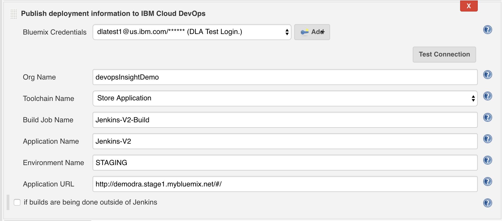
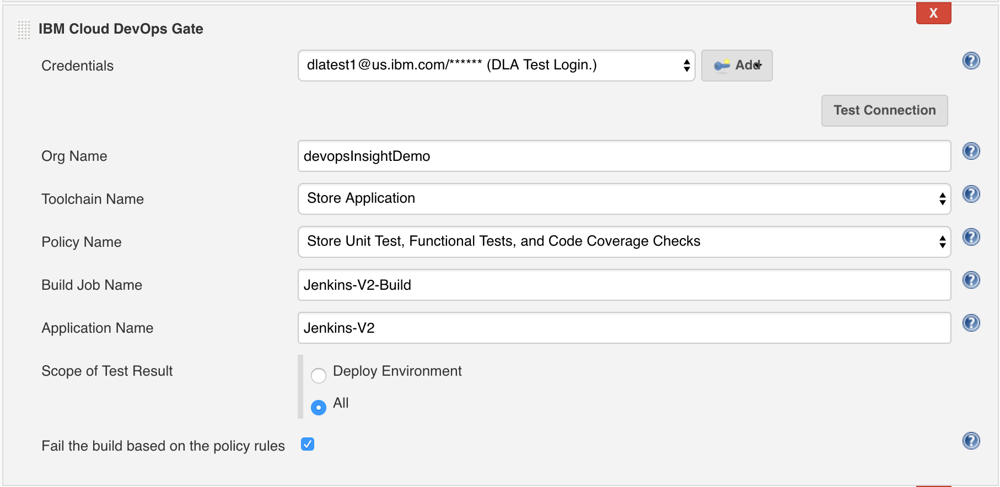

---

copyright:
  years: 2016, 2017
lastupdated: "2017-03-31"

---

{:new_window: target="_blank"}
{:shortdesc: .shortdesc}
{:screen: .screen}
{:codeblock: .codeblock}
{:pre: .pre}

# Deployment Risk
{: #gettingstarted}

{{site.data.keyword.DRA_short}} 提供了有关部署（尤其是风险方面）的大量信息。您可以使用这些信息在 Delivery Pipeline 中通过策略和检测点来自动保障质量。
{:shortdesc}

在工具链中打开 {{site.data.keyword.DRA_short}} 后，单击 **Deployment Risk**。在其中，可以了解编译打包和生产环境中应用程序的概况，并可向下钻取以了解代码覆盖、测试性能和安全报告。仪表板中会自动填充管道的 {{site.data.keyword.DRA_short}} 测试生成的最新信息。

## 关于 Deployment Risk
{: #about}

可以使用 Deployment Risk 在工具链中通过策略和检测点来强制实施质量标准。策略由规则集构成；检测点强制实施策略。例如，可创建“单元测试和测试覆盖”策略，此策略要求构建符合单元测试和测试覆盖标准。然后，将引用此策略的检测点添加到 Continuous Delivery 过程。不符合此策略的构建会在该检测点处停止。 

Deployment Risk 与 {{site.data.keyword.deliverypipeline}}（{{site.data.keyword.contdelivery_full}} 的一部分）和 Jenkins 项目一起使用。在高级别，这两者的使用指示信息非常类似。  

如果使用的是 {{site.data.keyword.deliverypipeline}}，请执行以下步骤：

1. [创建策略和规则](#policies_and_rules)以供 {{site.data.keyword.DRA_short}} 管理。
2. [准备管道阶段](#integrate_pipeline)，以便与 {{site.data.keyword.DRA_short}} 相集成。

3. 在管道中[创建或编辑测试作业](#configure_pipeline_jobs)，以用于将结果上传到 {{site.data.keyword.DRA_short}}。
4. 向管道[添加检测点](#configure_pipeline_gates)，管道将基于这些结果和策略做出升级决策。
5. 运行管道并[查看结果](#view_results)。

如果使用的是 Jenkins，请执行以下步骤：

1. [创建策略和规则](#policies_and_rules)以供 {{site.data.keyword.DRA_short}} 管理。
2. [安装并配置 Jenkins 插件](#integrate_jenkins)。
3. [创建测试作业和检测点，如插件指示信息中所述](#integrate_jenkins)。测试会将结果上传到 {{site.data.keyword.DRA_short}} 进行分析，而检测点会使用这些结果来做出升级决策。
4. 运行项目并[查看结果](#view_results)。 

不管您如何构建和部署代码，结果都一样：符合标准的构建将通过 Deployment Risk 检测点，而不符合标准的构建则会停止。 

## 先决条件
{: #prerequisites}

除了 [{{site.data.keyword.DRA_short}} 入门](/docs/services/DevOpsInsights/index.html)中所述的配置外，Deployment Risk 还需要另外一些配置。

要使用 Deployment Risk，需要下面两项：

* {{site.data.keyword.deliverypipeline}} 实例或 Jenkins 项目
* 要用于评估项目的测试

## 创建策略和规则
{: #policies_and_rules}

策略是规则集，用于控制 Delivery Pipeline 中的检测点。如果您的代码不符合或超出在特定检测点执行的策略，那么会暂停部署以防止发布有风险的更改。

您可在 {{site.data.keyword.DRA_short}} 中定义策略。这将在包含 {{site.data.keyword.DRA_short}} 的 {{site.data.keyword.Bluemix_notm}} 组织中创建策略。相同组织中的任何应用程序都可以使用该策略。 

### 创建策略
{: #create_policies}

要创建策略，请执行以下操作：

1. 在左侧导航中，单击**设置**。

2. 单击**策略**。

3. 单击**创建策略**，然后输入新策略的名称和描述。

4. 单击**下一步**。

4. 至少添加一个规则到策略：
  1. 单击**向策略添加规则**。
  2. 选择规则类型。
  3. 输入规则的详细信息和条件。
  4. 单击**保存**。

5. 当您完成添加规则到策略时，单击**完成**。

### 创建规则
{: #creating_rules}

规则定义了策略用于判断成功或失败的条件。您可创建“单元测试和测试覆盖”策略，其中包含单元测试规则（需要 80% 的单元测试成功）和测试覆盖规则（需要 100% 代码覆盖）。如果在管道中添加了引用此规则的检测点，那么该检测点可阻止不能同时满足这两个规则的任何构建继续进行。 

您可以通过将测试标记为“重要”，从而要求测试在任何情况下都必须成功。要创建规则，请选择策略，然后单击**向策略添加规则**。 

#### 创建功能验证测试规则
{: #criteria_fvt}

1. 键入描述并选择格式。

2. 指定必须通过并声明成功的测试用例百分比。

3. 定义重要的任何测试用例。

4. 要监视测试用例回归，请选中**监视测试用例回归**复选框。

5. 单击**保存**。

#### 创建单元测试规则
{: #criteria_ut}

1. 键入描述并选择格式。

2. 指定必须通过并声明成功的测试用例百分比。

3. 定义重要的任何测试用例。

4. 要监视测试用例回归，请选中**监视测试用例回归**复选框。

5. 单击**保存**。

#### 创建代码覆盖规则
{: #criteria_codecoverage}

1. 键入描述并选择格式。

2. 指定需要声明成功的代码覆盖百分比。

3. 要监视代码覆盖回归，请选中**监视测试用例回归**复选框。

4. 单击**保存**。

#### 创建静态安全扫描规则
{: #criteria_static}

可以将 {{site.data.keyword.DRA_short}} 与 IBM Application Security on Cloud 相集成，以运行静态代码和动态应用程序扫描。有关 Application Security on Cloud 的更多信息，请参阅[正式文档](/docs/services/ApplicationSecurityonCloud/index.html)。

1. 输入描述。

2. 指定规则允许的高严重性、中等严重性和低严重性问题的最大数量。 

3. 单击**保存**。

#### 创建动态安全扫描规则
{: #criteria_dynamic}

可以将 {{site.data.keyword.DRA_short}} 与 {{site.data.keyword.appseccloudfull}} 相集成以运行动态应用程序扫描。有关 Application Security on Cloud 的更多信息，请参阅[正式文档](/docs/services/ApplicationSecurityonCloud/index.html)。

1. 输入描述。

2. 指定规则允许的高严重性、中等严重性和低严重性问题的最大数量。 

3. 单击**保存**。

## 配置 {{site.data.keyword.deliverypipeline}} 
{: #configuration}

将 {{site.data.keyword.DRA_short}} 添加到工具链并定义其监视的策略之后，请将其与 {{site.data.keyword.deliverypipeline}} 相集成。
有关管道的更多信息，请参阅[正式文档](/docs/services/ContinuousDelivery/pipeline_working.html)。

### 准备管道阶段
{: #integrate_pipeline}

要使 Deployment Risk 能够分析项目，必须在管道中定义编译打包阶段和生产阶段。您可使用文本环境属性来定义阶段，这些属性位于每个阶段的配置菜单  的**环境属性**下。

1. 在编译打包阶段，将 `LOGICAL_ENV_NAME` 属性设置为 `STAGING`。 

2. 在生产阶段，将 `LOGICAL_ENV_NAME` 属性设置为 `PRODUCTION`。 

您还可以将以下属性添加到用于构建或部署应用程序的阶段：

* `LOGICAL_APP_NAME`，用于定义应用程序在仪表板上的名称。
* `BUILD_PREFIX`，用于定义附加到阶段构建前面的文本。此文本还会在仪表板中显示。 

### 添加测试作业
{: #configure_pipeline_jobs}

您可使用两种测试作业将 {{site.data.keyword.DRA_short}} 集成到管道中：一种是将结果上传到 {{site.data.keyword.DRA_short}} 进行分析的作业，另一种是对该分析执行操作的检测点。 

首先，将“高级测试器”作业添加到管道以运行测试并上传结果。 

**注：**如果要更新测试作业以将结果上传到 {{site.data.keyword.DRA_short}}，请在继续之前，先将其配置保存在方便的位置。然后，打开其作业配置菜单，并跳至第 3 步。 

1. 在要添加用于上传结果的作业的阶段中，单击**阶段配置**图标 。单击**配置阶段**。
2. 创建测试作业，然后输入其名称。 
3. 对于作业类型，选择**高级测试器**。
4. 填写**测试命令**和**工作目录**字段，就像对普通管道测试作业那样。 
5. 填写其余字段，以上传特定测试类型的测试结果。 

 1. 选择与要使用的 {{site.data.keyword.DRA_short}} 策略中所定义类型相匹配的度量类型。
 2. 输入结果文件位置。此位置是工作目录的相对位置。 

6. 如果要在同一作业中上传另一种测试类型的结果，请填写前缀为*其他*的字段。
7. 单击**保存**以返回管道。

**度量的类型**和**结果文件位置**字段的值必须匹配正确的格式：

<table><thead>
<tr>
<th>度量的类型</th>
<th>支持的格式</th>
</tr>
</thead><tbody>
<tr>
<td>功能验证测试</td>
<td>Mocha、xUnit</td>
</tr>
<tr>
<td>单元测试</td>
<td>Mocha、xUnit、Karma/Mocha</td>
</tr>
<tr>
<td>代码覆盖</td>
<td>Istanbul、Blanket.js</td>
</tr>
</tbody></table>

图 1 显示的测试作业配置为运行单元测试、以 Mocha 格式上传结果，以及以 Istanbul 格式上传代码覆盖结果。

*图 1. 将结果上传到 DevOps Insights*

### 定义检测点
{: #configure_pipeline_gates}

{{site.data.keyword.DRA_short}} 检测点用于检查测试结果是否符合所定义的策略。如果不符合策略，那么缺省情况下 {{site.data.keyword.DRA_short}} 检测点将失败。您还可以将检测点配置为以建议角色执行操作，以允许管道在即便发生失败后仍继续运行。

Deployment Risk 仪表板依赖于编译打包部署作业后存在检测点。如果要使用该仪表板，请确保您在部署到编译打包环境后，但在部署到生产环境之前拥有检测点。

通常，检测点在管道中构建升级之前放置。这些位置非常适合根据策略检查构建的质量，以确保构建能够安全地从一个环境升级到另一个环境。但是，您可以将检测点放置在管道中您要检查特定条件的任何位置。在部署到编译打包环境之前放置的检测点仍将强制实施策略，但这些检测点不会在 Deployment Risk 仪表板上显示。

1. 在阶段上，单击**阶段配置**图标 ，并单击**配置阶段**。
2. 单击**添加作业**。对于作业类型，选择**测试**。
3. 对于测试器类型，选择 **{{site.data.keyword.DRA_short}} 检测点**。
4. 指定环境名称。确保此值匹配[环境属性](#toolchain_pipeline_props)中所定义的内容。
5. 输入要在此检测点检查的策略名称。

 此名称必须与所定义的其中一个策略名称完全匹配。在与工具链相同的 {{site.data.keyword.Bluemix_notm}} 组织中，您仅可以指定一个所定义的策略。

6. 可选：要使检测点在建议方式下发挥作用，请清除**此作业失败时停止运行此阶段**复选框。在建议方式下，{{site.data.keyword.DRA_short}} 会在该检测点完成相同的策略分析并生成报告，但是如果发生失败，却不会停止管道。
7. 单击**保存**以返回管道。
8. 重复以上步骤，为所有 {{site.data.keyword.DRA_short}} 策略设置检测点。

*图 2. DevOps Insights 检测点*

配置管道之后，开始使用 {{site.data.keyword.DRA_short}}。有关指示信息，请参阅[运行 Delivery Pipeline](/docs/services/DevOpsInsights/pipeline_decision_reports.html#toolchain_reports)。

## 配置 Jenkins 项目
{: #integrate_jenkins}

将 {{site.data.keyword.DRA_full}} 添加到开放工具链并定义其监视的策略之后，可以将其与 Jenkins 项目相集成。
 

IBM Cloud DevOps for Jenkins 插件可将 Jenkins 项目与工具链相集成。_工具链_是一组工具集成，用于支持开发、部署和操作任务。工具链的整体能力大于其各个单独工具集成的总和。开放工具链是 {{site.data.keyword.contdelivery_full}} 服务的组成部分。要了解有关 {{site.data.keyword.contdelivery_short}} 服务的更多信息，请参阅[其服务文档](https://console.ng.bluemix.net/docs/services/ContinuousDelivery/cd_about.html)。

安装 IBM Cloud DevOps 插件后，可以将测试结果发布到 {{site.data.keyword.DRA_short}}，添加自动质量检测点以及跟踪部署风险。您还可以将作业通知发送给工具链中的其他工具，例如 Slack 和 PagerDuty。为了帮助您跟踪部署，工具链可以将部署消息添加到 Git 落实及其相关的 Git 或 JIRA 问题。此外，还可以在工具链的“连接”页面上查看部署。 

该插件提供了构建后操作和 CLI 以支持集成。{{site.data.keyword.DRA_short}} 聚集和分析单元测试、功能测试、代码覆盖工具、静态安全代码扫描和动态安全代码扫描的结果，以确定您的代码是否符合部署过程中检测点处的预定义策略。如果您的代码不满足或超出策略，那么会暂停部署以防止发布有风险的更改。您可以使用 {{site.data.keyword.DRA_short}} 作为持续交付环境的安全网、作为随时间实现和提高质量标准的方法，以及作为帮助您了解项目运行状况的数据可视化工具。

### 先决条件
{: #jenkins_prerequisites}

您必须有权访问正在运行 Jenkins 项目的服务器。

### 创建工具链
{: #jenkins_create}

必须创建工具链后，才能将 {{site.data.keyword.DRA_short}} 与 Jenkins 项目相集成。 

1. 要创建工具链，请转至[创建工具链页面](https://console.ng.bluemix.net/devops/create)并按照该页面上的指示信息进行操作。 

2. 创建工具链后，向其添加 {{site.data.keyword.DRA_short}}。有关指示信息，请参阅 [{{site.data.keyword.DRA_short}} 文档](https://console.ng.bluemix.net/docs/services/DevOpsInsights/index.html)。 

### 安装插件
{: #jenkins_install}

首先，从 {{site.data.keyword.DRA_short}} 下载插件。  

1. 在工具链的“概述”页面中，单击 **DevOps Insights**。
2. 单击**设置**，然后单击 **Jenkins 插件设置**。
3. 按照页面上的指示信息下载该插件。

然后，在 Jenkins 服务器上安装插件。

1. 单击**管理 Jenkins &gt; 管理插件**，然后单击**高级**选项卡。
2. 单击**选择文件**并选择 IBM Cloud DevOps 插件安装文件。 
3. 单击**上传**。
4. 重新启动 Jenkins 并验证已安装插件。

### 为 Deployment Risk 仪表板配置 Jenkins 作业
{: #jenkins_configure}

安装插件之后，可以将 {{site.data.keyword.DRA_short}} 集成到 Jenkins 项目中。 

要将 Deployment Risk 的检测点和仪表板用于您的项目，请执行以下步骤。

1. 打开您拥有的任何作业（例如，构建、测试或部署）的配置。

2. 针对相应类型，添加构建后操作：

   * 对于构建作业，使用**将构建信息发布到 IBM Cloud DevOps**。
   
   * 对于测试作业，使用**将测试结果发布到 IBM Cloud DevOps**。
   
   * 对于部署作业，使用**将部署信息发布到 IBM Cloud DevOps**。
   
3. 填写必填字段。
这些字段将根据作业类型而变化。 

   * 从**凭证**列表中，选择您的 {{site.data.keyword.Bluemix_notm}} 标识和密码。如果它们未保存在 Jenkins 中，请单击**添加**按钮以添加并保存这些内容。通过单击**测试连接**，测试与 {{site.data.keyword.Bluemix_notm}} 的连接。
   
   * 在**构建作业名**字段中，指定与 Jenkins 中完全一样的构建作业名。如果构建与测试作业一起执行，请将此字段保留为空。如果构建作业在 Jenkins 外执行，请选中**构建在 Jenkins 外完成**复选框，并指定构建号和构建 URL。
   
   * 对于环境，如果测试正在构建阶段中运行，请仅选择构建环境。如果测试正在部署阶段中运行，请选择部署环境并指定环境名称。支持两个值：`STAGING` 和 `PRODUCTION`。
   
   * 对于**结果文件位置**字段，请指定结果文件的位置。如果测试未生成结果文件，请将此字段保留为空。插件将基于当前测试作业的状态，上传缺省结果文件。

   以下各图显示了示例配置：
   
   
   _发布构建信息_
   
   
   _发布测试结果_
   
   
   _发布部署信息_

4. 如果要使用 {{site.data.keyword.DRA_short}} 策略检测点来控制下游部署作业，请添加构建后操作 **IBM Cloud DevOps 检测点**。选择策略，并指定测试结果的作用域。要允许策略检测点阻止下游部署，请选中**基于策略规则阻止构建**复选框。下图显示了示例配置：

    

5. 运行 Jenkins 构建作业。

6. 通过转至 [IBM Bluemix DevOps](https://console.ng.bluemix.net/devops)，选择您的工具链并单击 **DevOps Insights** 来查看 Deployment Risk 仪表板。

Deployment Risk 仪表板依赖于编译打包部署作业后存在检测点。如果要使用该仪表板，请确保您在部署到编译打包环境后，但在部署到生产环境之前拥有检测点。
    
### 配置通知
{: #jenkins_notifications}

可以通过遵循 [Bluemix 文档](https://console.ng.bluemix.net/docs/services/ContinuousDelivery/toolchains_integrations.html#jenkins)中的指示信息来配置用于向 Slack 或 PagerDuty 之类的工具发送通知的 Jenkins 作业。

此示例显示了如何配置用于作业配置的 `ICD_WEBHOOK_URL`：

此示例显示了如何配置用于作业通知的构建后操作：

## 查看结果
{: #view_results}

在管道运行后，{{site.data.keyword.DRA_short}} 会开始从管道收集并分析测试结果，以建立基线。它会收集每个后续运行所产生的数据并与之前的结果进行比较。决策检测点使用此数据来确定何时停止部署。 

可以在 Deployment Risk 仪表板中查看部署和检测点评估数据。要打开该仪表板，请打开 {{site.data.keyword.DRA_short}}，然后在侧边菜单中，单击 **Deployment Risk**。

如果使用的是 {{site.data.keyword.contdelivery_short}} Pipeline，那么可以在管道自身中查看各个检测点执行报告。要查看管道中某个检测点的决策报告，请执行以下步骤：

1. 在包含要检查的检测点的阶段上，单击**查看日志和历史记录**。

2. 在包含检测点的作业中，单击检测点的名称。

3. 在日志视图中，找到“`在此处查看 {{site.data.keyword.DRA_short}} 报告`”消息并单击链接以打开报告。

