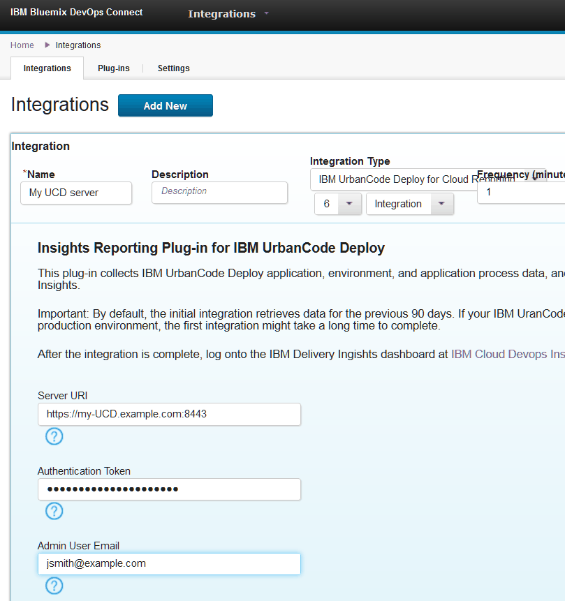

---

copyright:
  years: 2017

lastupdated: "2017-07-21"

---

{:new_window: target="_blank"}
{:shortdesc: .shortdesc}
{:screen: .screen}
{:codeblock: .codeblock}
{:pre: .pre}

# 显示 IBM UrbanCode Deploy 服务器的数据
{: #connect_ucd}

要在 Delivery Insights 中查看 IBM UrbanCode Deploy 服务器中的数据，必须设置 DevOps Connect 的实例，在该服务器上安装补丁，然后将该服务器连接到 DevOps Connect。
{:shortdesc}

## 先决条件
{: #prereqs}

要在 {{site.data.keyword.DRA_short}} 中查看 IBM UrbanCode Deploy 服务器中的信息，必须在可以连接到 IBM UrbanCode Deploy 服务器的系统上托管 DevOps Connect 实例。此系统可以是物理计算机，也可以是虚拟机。
 

托管 DevOps Connect 的系统必须满足以下先决条件：
- 系统必须具有 Java 运行时环境 (JRE) V8 或更高版本。
- 系统 `PATH` 变量必须包含 JRE 的位置。
- 系统必须允许 DevOps Connect 创建与 IBM Bluemix 的出局连接。

此外，IBM UrbanCode Deploy 服务器必须为 V6.2 或更高版本。

## 配置 {{site.data.keyword.DRA_short}} 服务
{: #configure_service}

如果不具有 {{site.data.keyword.DRA_short}} 服务，请添加该服务：
1. 登录到 {{site.data.keyword.Bluemix}}，然后单击**服务 > 仪表板**。
1. 单击**创建服务**。
1. 单击 {{site.data.keyword.DRA_short}} 服务。
1. 选择定价套餐，然后单击**创建**。
1. 单击**管理**，然后在“深入了解 UrbanCode 部署”下，单击**从这里开始**。
1. 在工具链模板窗口中，单击**创建**。  
Delivery Insights 会为您的组织创建工具链。工具链是工具集成的集合，在本例中，IBM UrbanCode Deploy 和 {{site.data.keyword.DRA_short}} 都是工具链的一部分。有关工具链的更多信息，请参阅[使用工具链](../ContinuousDelivery/toolchains_working.html)。
1. 在工具链中，单击 IBM UrbanCode Deploy 工具。
1. 单击设置按钮，然后单击**设置**。

以后将可以通过单击**服务 > 仪表板**并单击 {{site.data.keyword.DRA_short}} 服务的实例而进入 {{site.data.keyword.DRA_short}}。

如果您已经有工具链，那么可向其添加 IBM UrbanCode Deploy 和 {{site.data.keyword.DRA_short}} 工具，并通过这些工具访问 Delivery Insights。然后，单击 IBM UrbanCode Deploy 工具，单击设置按钮，再单击**设置**。

现在，您可以遵循**设置指示信息**页面上的指示，安装 DevOps Connect 并将其连接到 {{site.data.keyword.DRA_short}}，如下一节所述。

## 安装 DevOps Connect 并将其连接到 {{site.data.keyword.DRA_short}}
{: #install_connect}

1. 在**设置指示信息**页面上，执行设置 DevOps Connect 并连接 IBM UrbanCode Deploy 服务器的步骤。这些步骤包括：
{: #set_up_connect}
  1. 设置用于运行 DevOps Connect 的系统，如[先决条件](uc_insights_connect_ucd.html#prereqs)中所述。
  1. 下载 DevOps Connect，其在可运行的 JAR 文件中提供。

  1. 如果使用代理连接到因特网，请将系统变量 `_JAVA_OPTIONS` 设置为以下值：
    * 如果代理使用 HTTPS，请将 `_JAVA_OPTIONS` 设置为 `-Dhttps.proxyHost=HOSTNAME -Dhttps.proxyPort=PORT`，其中 `HOSTNAME` 是代理服务器的主机名，`PORT` 是代理服务器的 HTTPS 端口。
    * 如果代理使用 HTTP，请将 `_JAVA_OPTIONS` 设置为 `-Dhttp.proxyHost=HOSTNAME -Dhttp.proxyPort=PORT`，其中 `HOSTNAME` 是代理服务器的主机名，`PORT` 是代理服务器的 HTTP 端口。

  1. 复制**设置指示信息**页面中的命令。此命令可启动 DevOps Connect，并带有一个令牌，允许连接到您在 {{site.data.keyword.Bluemix}} 上的组织。
  1. 缺省情况下，DevOps Connect 在端口 8443 上运行，这是缺省情况下运行 IBM UrbanCode Deploy 服务器的相同端口。因此，如果 IBM UrbanCode Deploy 服务器或任何其他服务正在端口 8443 上运行，请将参数 `-Dserver.port` 添加到命令中，以更改 DevOps Connect 的端口。例如，要将 DevOps Connect 设置为使用端口 8888，那么命令的开头应如下所示：  
```bash
java -Dserver.port=8888 -jar devops-connect-2.0.92clear0618.jar -Dserver.port=8888
```  

完整命令中包含有关 Bluemix 帐户的信息，该帐户会自动配置 DevOps Connect，如以下示例所示：

```bash
java -Dserver.port=8888 -jar devops-connect-2.0.920618.jar --sync.id=a2c12cb9-9a09-9832-479b01bf --sync.token=j0zs325U6qp080pzpcQ  --sync.registrar=jsmith@example.com
```

  1. 运行命令，并等待 DevOps Connect 启动。

  1. 将您的 IBM UrbanCode Deploy 服务器连接到 DevOps Connect，如下一节中所述。

## 将 IBM UrbanCode Deploy 服务器连接到 DevOps Connect
{: #connect_ucd_to_connect}

1. 如果 IBM UrbanCode Deploy 服务器早于 V6.2.5，请在服务器上安装补丁。V6.2.5 及更高版本不需要补丁。
  1. 从以下页面下载与您的 IBMUrbanCode Deploy 版本相应的正确补丁。例如，IBM UrbanCode Deploy 6.2.4.x 的补丁文件名为 [ucd-6.2.4.0-WI161775-Devops-Insights-Patch.jar](http://public.dhe.ibm.com/software/products/UrbanCode/plugins/ucsync/patches/ibmucd/6_2_4_X/ucd-6.2.4.0-WI161775-Devops-Insights-Patch.jar)。  
  
    [http://public.dhe.ibm.com/software/products/UrbanCode/plugins/ucsync/patches/ibmucd/](http://public.dhe.ibm.com/software/products/UrbanCode/plugins/ucsync/patches/ibmucd/)

  1. 停止服务器。请参阅[启动和停止服务器](https://www.ibm.com/support/knowledgecenter/SS4GSP_6.2.5/com.ibm.udeploy.install.doc/topics/run_server.html)。

  1. 将补丁文件放入 <code><em>application_data</em>/patches</code> 文件夹中，其中 <code><em>application_data</em></code> 是服务器应用程序数据文件夹。缺省应用程序数据文件夹在 Linux 上为 `/opt/ibm-ucd/server/appdata`，在 Windows 上为 `C:\Program Files\ibm-ucd\server\appdata`。在高可用性系统上，应用程序数据文件夹始终位于每个服务器都可访问的共享网络驱动器上。

  1. 可选：服务器停止期间，要提高从此服务器导入数据的性能，请在数据库上运行以下 SQL 命令。V6.2.5 及更高版本上不需要这些命令。  
  `create index rt_cpr_submitted_time on MyUCDDatabase.rt_app_process_request(submitted_time);`  
  `create index rt_cpr_submitted_time on MyUCDDatabase.rt_comp_process_request(component_id, submitted_time);`  
  将您的数据库的名称用于 `MyUCDDatabase`。
  <!-- Ross says that this will not be necessary for versions 6.2.4.1 and later if he gets his code changes in. -->

  1. 启动服务器。 

    **注：**您需要等待的时间可能要比通常等待 IBM UrbanCode Deploy 服务器启动的时间更长。如果服务器最终未启动或未正常运行，请删除补丁文件，然后重新启动服务器。补丁文件不会永久影响服务器。

1. 某些版本的 IBM UrbanCode Deploy 需要额外的补丁才能使服务器连接到 DevOps Connect。如果使用的是 IBM UrbanCode Deploy V6.2 到 V6.2.1.2，那么必须在服务器上安装以下额外补丁：
  1. 下载补丁：[http://public.dhe.ibm.com/software/products/UrbanCode/plugins/ucsync/patches/ibmucd/ucd-6.2.1.1-WI149200-CLI-Updates-for-UCSync.jar](http://public.dhe.ibm.com/software/products/UrbanCode/plugins/ucsync/patches/ibmucd/ucd-6.2.1.1-WI149200-CLI-Updates-for-UCSync.jar)。
  1. 停止服务器。
  1. 将补丁文件放入 <code><em>application_data</em>/patches</code> 文件夹中。
  1. 启动服务器。

1. 创建 DevOps Connect 与 IBM UrbanCode Deploy 服务器的集成：  

  **重要信息：**集成首次运行时，DevOps Connect 会检索前 90 天的数据。如果有大量部署数据，那么此过程可能需要很长时间。要检索少于 90 天的数据，请参阅[故障诊断](uc_insights_connect_ucd.html#troubleshooting)。
  1. 在 IBM UrbanCode Deploy 中，创建认证令牌。请参阅[令牌](https://www.ibm.com/support/knowledgecenter/SS4GSP_6.2.5/com.ibm.udeploy.admin.doc/topics/security_token.html)。
  1. 在 DevOps Connect 中，单击**集成**，然后单击**添加新项**。
  1. 指定集成的名称和描述。DevOps Connect 的缺省位置为 `https://hostname:8443/`，其中 `hostname` 是托管 DevOps Connect 的系统的主机名。
  1. 从**集成类型**列表中，选择 **IBM UrbanCode Deploy for Cloud Reporting**。
  1. 在**服务器 URI** 字段中，输入 IBM UrbanCode Deploy 服务器的公共 URL，例如 `https://my_UCD.example.com:8447`。
  1. 在**认证令牌**字段中，输入或粘贴 IBM UrbanCode Deploy 生成的认证令牌。
  1. 在**管理用户**字段中，输入要向其授予 DevOps Connect 界面访问权的 IBM 标识的逗号分隔列表。
  1. 可选：单击**运行集成**以立即运行集成。缺省情况下，集成会每分钟运行一次。
  1. 单击**保存**。

  

现在，您的数据已经与 Delivery Insights 同步。可以立即创建并查看基于这些数据的报告。接下来，将 IBM UrbanCode Deploy 服务器上的环境映射到 Delivery Insights 中的逻辑环境。

## 将环境映射到报告
{: #mapping}

### 逻辑环境

Delivery Insights 将 IBM UrbanCode Deploy 环境（也称为*物理环境*）分组成一个或多个逻辑环境。通过这种方式，可以根据您及您组织的需要，按组收集环境。例如，如果针对多个应用程序有多个生产环境，那么可以将所有这些环境分组到单个逻辑环境中，并将所有这些环境的度量值合并到单个生产环境仪表板中。映射通过搜索字符串执行，所以您可以按适合 IBM UrbanCode Deploy 服务器需要的任意方式对环境分组。

### 缺省逻辑环境

缺省情况下，报告使用字符串来包含与 IBM UrbanCode Deploy 环境匹配的逻辑环境。例如，名称中具有“dev”的所有环境都会映射到 DEV 逻辑环境，而名称中具有“prod”的所有环境都会映射到 PROD 逻辑环境。


### 将环境映射到逻辑环境

您可以手动将物理环境映射到逻辑环境，也可以使用模式以动态方式将物理环境与逻辑环境相关联。

要将物理环境映射到逻辑环境，请执行以下步骤：

1. 打开 Delivery Insights，单击设置按钮，并单击**映射环境**。
1. 在“环境映射”页面上，单击现有逻辑环境或通过单击**添加逻辑环境**创建逻辑环境。
1. 使用所选逻辑环境，可指定要将环境映射到逻辑环境的模式。在**包含的模式**下，单击**添加模式**，并指定要使用的模式。名称与模式匹配的所有环境（包括稍后创建的环境）都会添加到逻辑环境中。可以使用星号 (*) 作为通配符。例如，模式 `env` 与环境 `env1`、`env2` 和 `env` 相匹配。
1. 要手动将环境映射到逻辑环境，请单击**手动添加**，然后选择要添加或除去的环境。
1. 验证逻辑环境是否包含需要的环境。


现在，您已将环境映射到逻辑环境，因此可以按这些逻辑环境聚集报告信息。

## 将应用程序映射到业务线
{: #lines}

业务线是为常用业务用途提供服务的应用程序群组。您可以将应用程序映射到业务线，以更易于过滤图表中的应用程序。您还可以根据业务线创建图表。

要设置业务线 (LOB)，请遵循以下步骤：

1. 在 {{site.data.keyword.DRA_short}} 中，单击 **Delivery Insights**，单击设置按钮，然后单击**映射业务线**。
1. 在“业务线映射”页面上，单击现有 LOB，或通过输入名称并单击**创建**来创建 LOB。
1. 使用所选 LOB，可指定要将应用程序映射到 LOB 的模式。在**包含的模式**下，单击**添加模式**，并指定要使用的模式。名称与模式匹配的所有应用程序（包括稍后创建的应用程序）都会添加到 LOB 中。可以使用星号 (*) 作为通配符。例如，模式 `env` 与环境 `env1`、`env2` 和 `env` 相匹配。
1. 您还可以通过单击**个别映射的应用程序**，然后单击**添加应用程序**，从而手动将应用程序映射到 LOP。

设置 LOP 之后，可过滤图表，以仅显示特定 LOB 中的应用程序。其他图表显示基于 LOB 的度量值。

## 创建报告

要创建报告，请打开 {{site.data.keyword.DRA_short}}，单击 **Delivery Insights**，然后单击**添加报告**。如果未看到**添加报告**，表明 IBM UrbanCode Deploy 服务器尚未连接。单击设置按钮，然后单击**设置**以连接服务器。

在报告中，可以向**度量值**部分添加卡，过滤**最近应用程序活动**下的活动，以及向**报告详细信息**部分添加图表。在**报告详细信息**部分中的每个图表都可单独进行过滤和定制。要查看图表基于的原始数据，请单击图表右上方的图表“设置”按钮，然后单击**报告数据**。

要更改图表的顺序，请单击页面右上方的“设置”按钮，然后单击**编辑图表布局**。接着，可以拖放图表来设置报告上的顺序。

## 共享报告
缺省情况下，只有您可以查看 Delivery Insights 报告。您可以与 Bluemix 组织中的其他用户共享报告。要与 Bluemix 组织中的某个人共享报告，请打开报告，单击报告右上方的“设置”按钮，然后单击**共享**。  

。

## 创建审计报告

审计报告将满足所设置过滤器的所有活动的完整列表显示为 PDF。要创建审计报告，请单击 **Delivery Insights**，单击设置按钮，然后单击**创建审计报告**。然后，指定报告的信息，包括名称。此外，设置报告的上下文，例如应用程序、逻辑环境或 IBM UrbanCode Deploy 服务器上的环境（物理环境）。在其中，选择要在报告中显示的数据，然后单击**创建**。 

## 故障诊断
{: #troubleshooting}

如果在 IBM UrbanCode Deploy 服务器数据库中存储了许多应用程序和组件流程请求，那么在检索过程中可能会发生错误。在服务器输出日志中会记录类似以下文本的消息：

`ORA-01652: unable to extend temp segment by 128 in tablespace TEMP`

要解决此行为，请编辑插件的 `plugin.properties` 文件，以减少要检索的数据天数。`plugin.properties` 文件位于安装了 DevOps Connect 的计算机上的 `~/.ibm/cloud-sync/plugins/settings/reporting-ucd-plugin/` 目录中。编辑以下行以除去井号 (#) 并减少天数：

`#numDaysToRetrieve=90`

例如，将该行更改为以下文本，以只检索前 30 天的数据：

`numDaysToRetrieve=30`

保存文件，然后重新运行集成。检查服务器日志以确保该错误不再发生。
