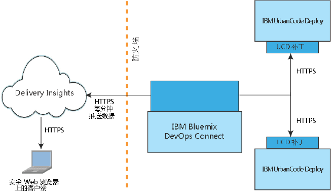

---

copyright:
  years: 2017
lastupdated: "2017-03-31"

---

{:new_window: target="_blank"}
{:shortdesc: .shortdesc}
{:screen: .screen}
{:pre: .pre}

# 集成 DevOps Insights 与 IBM UrbanCode Deploy - 概述
{: #uc_insights_overview}

Delivery Insights 是 {{site.data.keyword.DRA_short}} 的一部分，可显示部署统计信息、度量值以及有关 IBM UrbanCode Deploy 安装的其他信息。例如，可以显示部署持续时间、成功次数和失败次数的图表，所有数据均按以逻辑方式分组的环境排序。
{:shortdesc}

如果没有工具链或 {{site.data.keyword.DRA_short}}，那么必须首先设置 {{site.data.keyword.DRA_short}}：
1. 在 {{site.data.keyword.Bluemix}}“目录”中，单击 **{{site.data.keyword.DRA_short}}**，选择定价套餐，然后单击**创建**。
1. 单击**管理**选项卡，然后在**开始使用 Delivery Insights for UrbanCode** 下，单击**从这里开始**。Delivery Insights 会在后台为您的组织创建工具链。开放工具链是工具集成的集合，在本例中，IBM UrbanCode Deploy 和 {{site.data.keyword.DRA_short}} 都是工具链的一部分。有关工具链的更多信息，请参阅[使用工具链](../ContinuousDelivery/toolchains_working.html)。
1. 在 **Delivery Insights 设置**页面上，执行设置 DevOps Connect 并连接 IBM UrbanCode Deploy 服务器的步骤。
<!--  1. Set up a system to run DevOps Connect. See [prerequisites](uc_insights_prereqs.html).
  1. Download DevOps Connect, which is provided in a runnable JAR file.
  1. Copy the script from the **Delivery Insights Setup** page and run it. This command starts DevOps Connect with a token that allows it to connect to your organization on {{site.data.keyword.Bluemix}}.
  1. Connect your IBM UrbanCode Deploy servers to DevOps connect. See [Connecting IBM UrbanCode Deploy servers to Delivery Insights](uc_insights_connect_ucd.html). -->

如果您已经有工具链，请执行以下步骤来添加 Delivery Insights：
1. 如果尚没有 {{site.data.keyword.DRA_short}} 工具，请将其添加到工具链。
1. 在工具链上，单击 {{site.data.keyword.DRA_short}} 工具。
1. 在 **Delivery Insights 设置**页面上，执行设置 DevOps Connect 并连接 IBM UrbanCode Deploy 服务器的步骤。

设置了 Delivery Insights 和 DevOps Connect 后，可以在 Delivery Insights 中显示 IBM UrbanCode Deploy 服务器中的数据。请参阅[将 IBM UrbanCode Deploy 服务器连接到 Delivery Insights](uc_insights_connect_ucd.html)。

<!-- 
For questions or issues, see the [questions forum](https://developer.ibm.com/answers/?community=urbancode).
--> 

可以在 Delivery Insights 中查看的一些信息包括：

- 有关部署的统计信息，包括部署持续时间和随时间变化的部署量。
- 有关部署失败率的统计信息（按应用程序和环境）。
- 有关组件部署的统计信息，包括失败率、部署时间和持续时间。

## 系统概述

Delivery Insights 的拓扑包括 IBM UrbanCode Deploy <!-- (and optionally IBM UrbanCode Release) -->和 DevOps Connect 实用程序的一个或多个内部部署安装。

下图显示了这些系统的典型安装。

- 通过安装 **IBM UrbanCode Deploy**，可提供有关度量值的成功和失败部署的信息。IBM UrbanCode Deploy 需要补丁才可与 IBM Bluemix DevOps Connect 进行通信。

<!--
- **IBM UrbanCode Release** is an optional part of the topology. You can use the environment mappings in IBM UrbanCode Release to set logical environments for reports.

-->

- **IBM Bluemix DevOps Connect**（原名 IBM UrbanCode Sync Utility）用于协调 IBM UrbanCode Deploy <!-- and IBM UrbanCode Release -->内部部署安装与 IBM 托管的服务（如 UrbanCode Insights）之间的通信。DevOps Connect 与内部部署服务器之间使用安全 HTTPS 通信，并通过令牌认证向 UrbanCode Insights 提供数据。

  DevOps Connect 需要插件才可连接到拓扑中的其他系统。

- **Delivery Insights** 是 {{site.data.keyword.DRA_short}} 的一部分，根据环境组提供有关 IBM UrbanCode Deploy 上部署活动的度量值，包括部署时间和失败率。授权通过 {{site.data.keyword.Bluemix}} 帐户进行控制。
