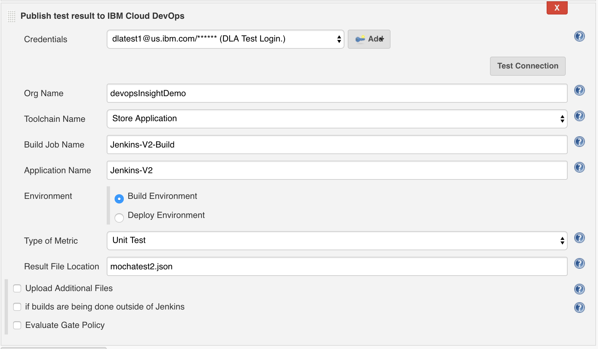
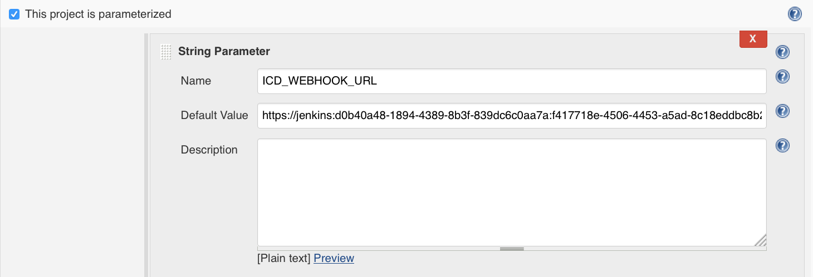

---

copyright:
  years: 2016, 2017
lastupdated: "2017-04-07"

---

{:new_window: target="_blank"}
{:shortdesc: .shortdesc}
{:screen: .screen}
{:codeblock: .codeblock}
{:pre: .pre}

# 與開放式 Jenkins 專案整合

將 {{site.data.keyword.DRA_full}} 新增至開放式工具鏈並定義它所監視的原則之後，可將它與您的開放式 Jenkins 專案整合。開放式 Jenkins 專案可從 Jenkins Web 介面進行配置及管理。 

適用於 Jenkins 的 IBM Cloud DevOps 外掛程式會將 Jenkins 專案與工具鏈整合。*工具鏈* 是一組支援開發、部署及操作作業的工具整合。工具鏈的群體力量大於其個別工具整合的總和。開放式工具鏈是 {{site.data.keyword.contdelivery_full}} 服務的一部分。若要進一步瞭解 {{site.data.keyword.contdelivery_short}} 服務，請參閱[其文件](https://console.ng.bluemix.net/docs/services/ContinuousDelivery/cd_about.html)。

安裝 IBM Cloud DevOps 外掛程式之後，您可以將測試結果發佈至 {{site.data.keyword.DRA_short}}、新增自動化品質閘道，以及追蹤您的部署風險。您也可以將工作通知傳送給工具鏈中的其他工具，例如 Slack 和 PagerDuty。為了協助您追蹤部署，工具鏈可以將部署訊息新增至 Git 確定及其相關 Git 或 JIRA 問題。您也可以在工具鏈的「連線」頁面上檢視您的部署。 

外掛程式提供後建置動作和 CLI 來支援整合。{{site.data.keyword.DRA_short}} 會聚集並分析單元測試、功能測試、程式碼涵蓋面工具、靜態安全程式碼掃描及動態安全程式碼掃描的結果，以在部署程序中判斷您的程式碼是否符合閘道的預先定義原則。如果您的程式碼不符合或超出原則，則會中止部署，以防止釋出有風險的變更。您可以使用 {{site.data.keyword.DRA_short}} 當作持續交付環境的安全網、實作與改善一段時間品質標準的方式，以及協助您瞭解專案性能的資料視覺化工具。

## 必要條件
{: #jenkins_prerequisites}

您必須能夠存取執行 Jenkins 專案的伺服器。

## 建立工具鏈
{: #jenkins_create}

您必須先建立工具鏈，才能將 {{site.data.keyword.DRA_short}} 與 Jenkins 專案整合。 

1. 若要建立工具鏈，請移至[「建立工具鏈」頁面](https://console.ng.bluemix.net/devops/create)，然後遵循該頁面上的指示。 

2. 建立工具鏈之後，將 {{site.data.keyword.DRA_short}} 新增至此工具鏈。如需相關指示，請參閱 [{{site.data.keyword.DRA_short}} 文件](https://console.ng.bluemix.net/docs/services/DevOpsInsights/index.html)。 

## 安裝外掛程式
{: #jenkins_install}

首先，從 {{site.data.keyword.DRA_short}} 下載外掛程式。  

1. 從工具鏈的「概觀」頁面中，按一下 **DevOps Insights**。
2. 按一下**設定**，然後按一下 **Jenkins 外掛程式設定**。
3. 遵循頁面上的指示下載外掛程式。

然後，在 Jenkins 伺服器上安裝外掛程式。

1. 按一下**管理 Jenkins &gt; 管理外掛程式**，然後按一下**進階**標籤。
2. 按一下**選擇檔案**，然後選取 IBM Cloud DevOps 外掛程式安裝檔。 
3. 按一下**上傳**。
4. 重新啟動 Jenkins，並驗證已安裝外掛程式。

## 配置 Deployment Risk 儀表板的 Jenkins 工作
{: #jenkins_configure}

安裝外掛程式之後，您可以將 {{site.data.keyword.DRA_short}} 整合至 Jenkins 專案中。 

遵循下列步驟，將 Deployment Risk 的閘道和儀表板用於您的專案。

1. 開啟您擁有之任何工作（例如建置、測試或部署）的配置。

2. 針對對應類型，新增後建置動作：

   * 若為建置工作，請使用**將建置資訊發佈至 IBM Cloud DevOps**。
   
   * 若為測試工作，請使用**將測試結果發佈至 IBM Cloud DevOps**。
   
   * 若為部署工作，請使用**將部署資訊發佈至 IBM Cloud DevOps**。
   
3. 完成必要欄位。必要欄位會因工作類型而有所不同。 

   * 從**認證**清單中，選取您的 {{site.data.keyword.Bluemix_notm}} ID 和密碼。如果 ID 和密碼未儲存在 Jenkins 中，請按一下**新增**，予以新增並儲存。按一下**測試連線**，以測試您與 {{site.data.keyword.Bluemix_notm}} 的連線。
   
   * 在**建置工作名稱**欄位中，指定與 Jenkins 中完全相同的建置工作名稱。如果建置隨著測試工作發生，請讓此欄位保留為空欄位。如果建置工作是在 Jenkins 外部發生，請選取**建置在 Jenkins 外部完成**勾選框，然後指定建置號碼和建置 URL。
   
   * 針對環境，如果測試是在建置階段執行，則只選取建置環境。如果測試是在部署階段執行，則選取部署環境，並指定環境名稱。可支援的值有兩個：`STAGING` 和 `PRODUCTION`。
   
   * 針對**結果檔案位置**欄位，請指定結果檔案的位置。如果測試未產生結果檔案，請讓此欄位保留為空欄位。外掛程式會上傳以現行測試工作狀態為基礎的預設結果檔案。

   下列影像顯示配置範例：
   
   
   *發佈建置資訊*
   
   
   *發佈測試結果*
   
   
   *發佈部署資訊*

4. 如果您要使用 {{site.data.keyword.DRA_short}} 原則閘道來控制下游部署工作，請新增後建置動作 **IBM Cloud DevOps 閘道**。選擇原則，並指定測試結果的範圍。為容許原則閘道防止下游部署，請選取**根據原則規則使建置失敗**勾選框。下列影像顯示配置範例：

    

5. 執行您的 Jenkins 建置工作。

6. 移至 [IBM Bluemix DevOps](https://console.ng.bluemix.net/devops)、選取您的工具鏈，然後按一下 **DevOps Insights**，以檢視 Deployment Risk 儀表板。

在暫置部署工作之後，Deployment Risk 儀表板需要有閘道存在。如果您想要使用此儀表板，請確定在部署至暫置環境之後，且部署至正式作業環境之前，有閘道存在。
    
## 配置通知
{: #jenkins_notifications}

您可以遵循 [Bluemix 文件](https://console.ng.bluemix.net/docs/services/ContinuousDelivery/toolchains_integrations.html#jenkins)中的指示，配置 Jenkins 工作，以將通知傳送至 Slack 或 PagerDuty 之類的工具。

此範例示範如何配置工作配置的 `ICD_WEBHOOK_URL`：

此範例示範如何配置工作通知的後建置動作：

